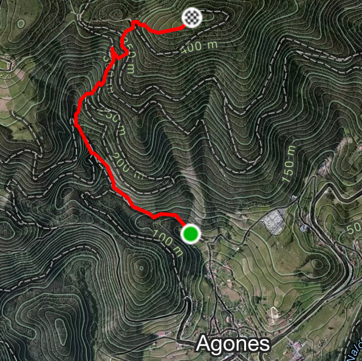
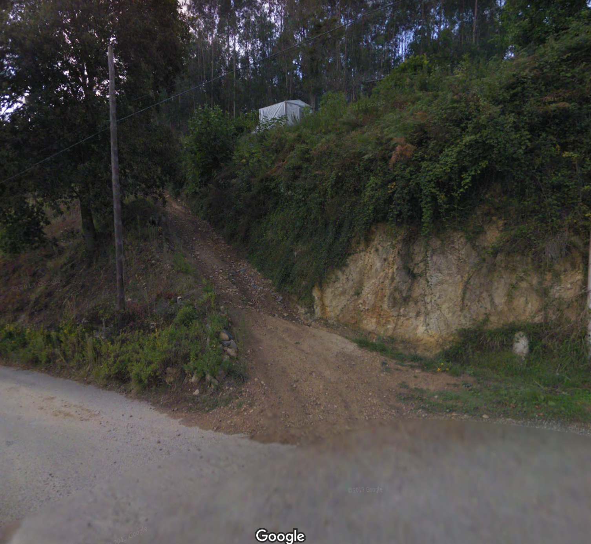

# AntenÓn Vertical Race (Virtual) 

La competición tendrá lugar entre el viernes 19 de junio y el domingo 19 de julio de 2020, ambos inclusive. La inscripción es gratuita y es estrictamente necesario seguir las restricciones y recomendaciones relativas a la salud  y seguridad con respecto al la situación de la COVID-19 en Asturias. 

## ¿QUÉ ES AntenÒn Vertical Race?

Es una competición virtual en la que los competidores/as tendrán que completar el recorrido de 2,3 kilómetros con 350 metros de desnivel positivo. Cada corredor/a participará contrarreloj, de forma individual (no se permite realizar la carrera en grupos de dos o más personas) y tendrá que registrar sus tiempos a través de un dispositivo GPS y subirlo a esta aplicación. Los/as atletas podrán realizar el circuito tantas veces como quieran, durante el periodo en el que está abierto, e ir subiendo los mejores tiempos.

Tienes un mes para hacerlo y subir tus resultados en cualquier momento. Si mejoras tu tiempo, puedes subir el mejor que tengas. Las clasificaciones irán variando cada día.

La competición es gratuita y está abierta a cualquier persona, siempre que cumpla con las recomendaciones de seguridad. 

El circuito está en Agones, Pravia, y sube hasta la antena repetidor que está sobre el Monte Santa Catalina, con meta en el repetidor de la parte superior. Tanto la salida, puntos intermedios,  y la meta están marcados correctamente para que no te pierdas. 

## ¿CÓMO COMPETIR?

La gestión de la competición se hace desde [OpenTrack](https://data.opentrack.run). Tienes que crear una cuenta e [inscribirte en la carrera](https://data.opentrack.run/en-gb/x/2020/ESP/antenon/) haciendo clic el botón correspondiente e introduce los datos personales que te va pidiendo. La inscripción es gratuita, así que aparecerá que tienes que pagar 0 (cero) euros.

Completa el circuito y cronométrate. Tienes que salir desde la zona marcada como salida (verás balizas y flechas), en el Barrio Molina de Agones (ver [la salida](https://www.google.com/maps/@43.5015398,-6.1221496,3a,75y,353.14h,91.94t/data=!3m6!1e1!3m4!1sM-zZuUFFb752lE-kHb5cZw!2e0!7i13312!8i6656)). Lo más sencillo es que te sitúes en la plaza de Agones y sigas las indicaciones que te llevarán hasta la salida. Si miras al norte, verás el repetidor del Monte Santa Catalina, que es donde acaba la carrera. Con tu GPS (Garmin, Polar, Suunto o el que uses) registra el tiempo desde la salida a la meta y guarda la prueba de lo que hiciste (es la prueba que tienes para demostrar que lo hiciste). 

Sube la prueba de tu actividad haciendo clic en el botón amarillo de la [web de la carrera](https://data.opentrack.run/en-gb/x/2020/ESP/antenon/).

También puedes hacer un seguimiento de los resultados y las puntuaciones según los competidores van subiendo los resultados.

## REGLAS

Se debe completar el circuito siguiendo las marcas situadas a lo largo del recorrido. La salida está en el Barrio Molina de Agones (ver <a href="https://www.google.com/maps/@43.5015398,-6.1221496,3a,75y,353.14h,91.94t/data=!3m6!1e1!3m4!1sM-zZuUFFb752lE-kHb5cZw!2e0!7i13312!8i6656">salida</a>) y la meta bajo las antenas del Monte Santa Catalina. Tanto la salida como la meta están marcadas (la meta está justo bajo las antenas). 

Zona de salida del AntenOn:

El circuito está marcado por la zona más directa, así que es complicado atajar. Puedes seguir otro camino alternativo o hacer alguna variación, siempre que salgas desde la zona marcada y llegues al repetidor. 

El atleta debe completar el recorrido individualmente y nunca en grupo. 

El atleta debe respetar las normas de movimiento y para la práctica deportiva en Asturias. El circuito está localizado íntegramente en el municipio de Pravia.

En todo momento, se deben respetar las normas de seguridad de separación si se cruza con otra persona el recorrido. En el caso de que se crucen dos atletas en sentido contrario, el que baje deberá ceder el paso al que sube en competición y apartarse, al menos, 2 metros.

Se valorará el tiempo más rápido de cada atleta y cualquier desviación de las normas motivará una penalización o descalificación del atleta en la prueba.

Este evento, aunque nos referimos a él como una competición, no es una carrera al uso. Nadie saca dinero de esto y cada uno lo hace para pasarlo bien y buscar alternativas a las competiciones en estos tiempos de coronavirus. Si te apuntas y participas, ten cuidado y extrema la precaución. Si vas solo/a completamente, lleva teléfono y algo de ropa para la bajada. No se dispone de seguros ni nada de eso, así que ***no te manques***. 

## CATEGORÍAS Y EQUIPOS

Se establecerá una clasificación por equipos (tanto masculino como femenino), donde puntuarán los mejores 3 atletas de cada equipo registrado. La puntuación será la suma de los tiempos de los tres mejores.

*¡IMPORTANTE! Antes de inscribir a un equipo, mándanos un correo a pbest.me@gmail.com con el nombre del mismo. Los atletas pertenecientes a ese equipo ya lo podrán seleccionar cuando entren en la plataforma.*

Se establecerán clasificaciones por categorías, según la IAAF y los años cumplidos en el año en curso.

Habrá premios, así que esfuérzate.

## PROBLEMAS PARA LA INSCRIPCIÓN

Puede ser que la plataforma tenga algún texto en inglés. Si tienes problemas para subir tus datos, puedes enviarnos un correo a pbest.me@gmail.com y lo intentaremos solucionar cuanto antes.

